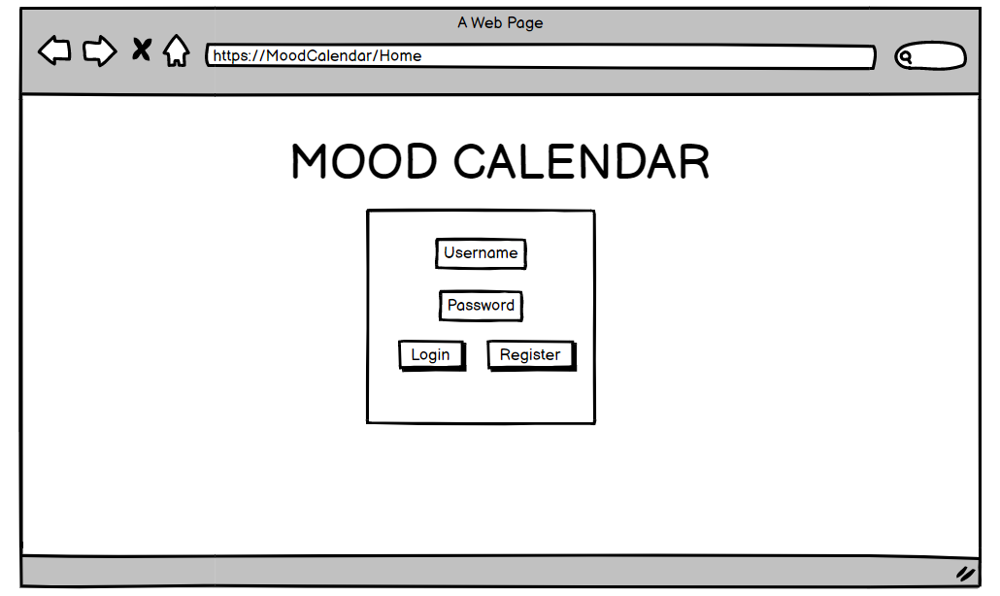
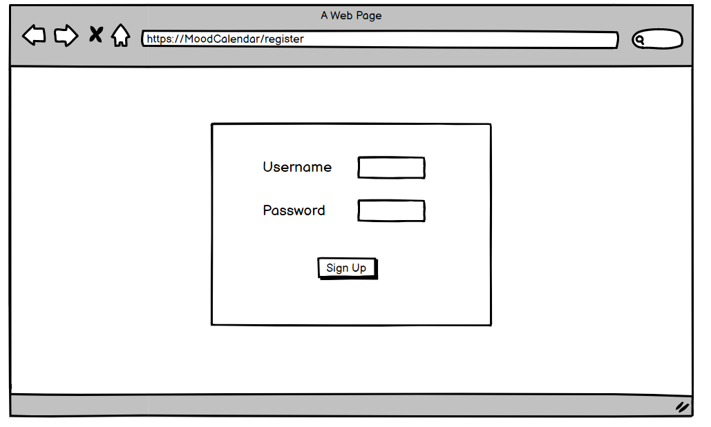
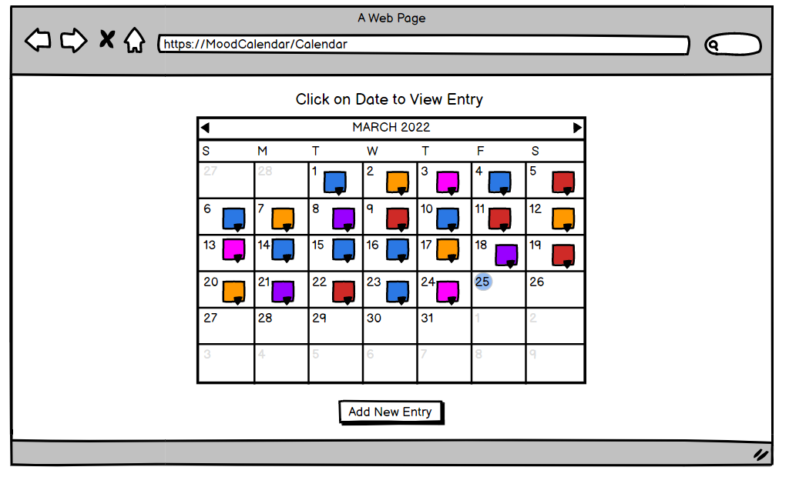
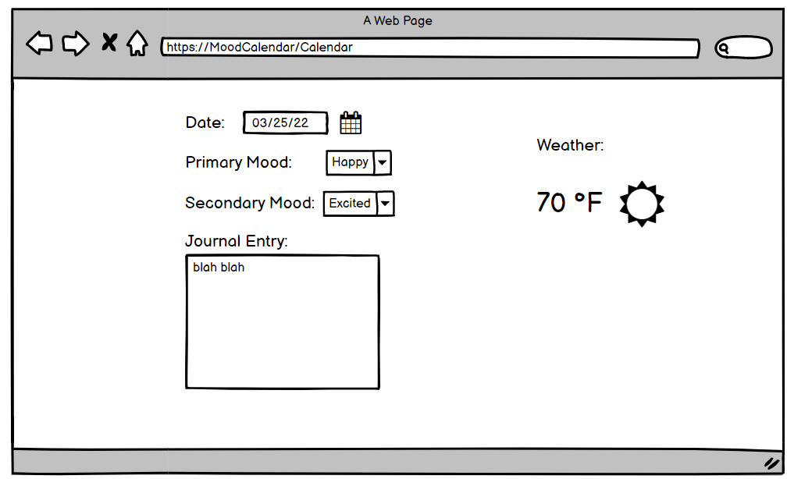
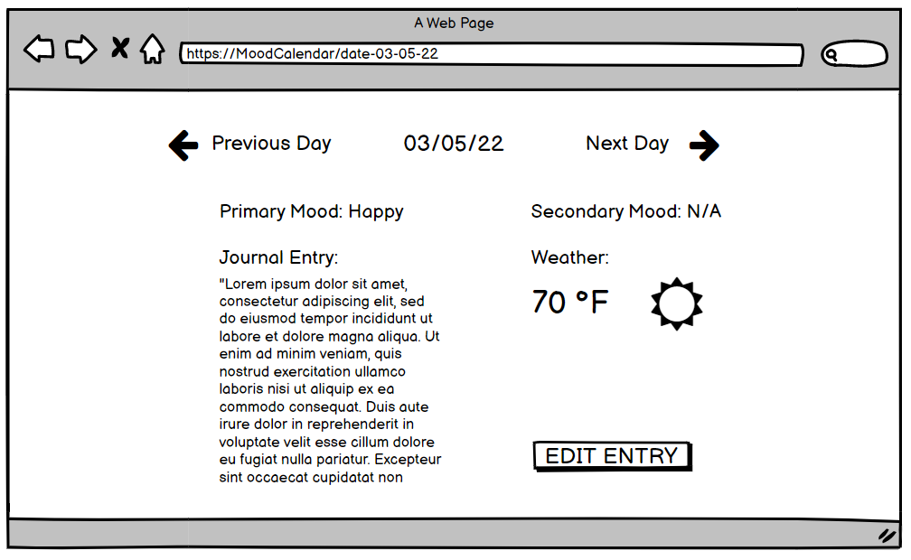
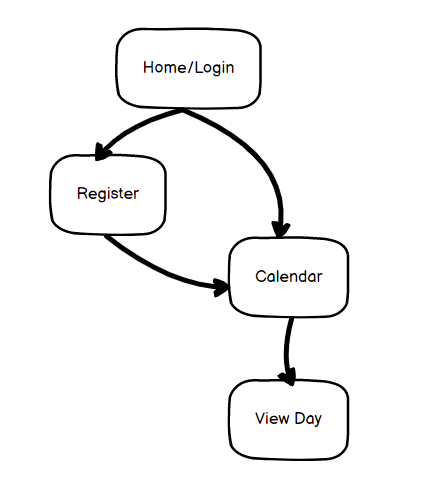

# Mood Calendar 

## Overview

Keeping track of every day in a year can be difficult through normal means of journaling with pencil and paper. Mood Calender is a web app that allows you to quickly 
view your mood throughout the year with a calander visualization that showcases every day with a different color depending on your mood. In addition to this you can add 
journal entries for every day of the year as well as add the weather to each entry so you will have a detailed look at everyday in the year. 

## Data Model

The application will store Users, Calendar, and Days

* users can have only one Calendar (by reference)
* each Calendar can have multiple Days (by embedding)

An Example User:

```javascript
{
  username: "rakeebHossain",
  hash: // a password hash,
  calendar: // a reference to Calendar document
}
```

An Example Calendar:

```javascript
{
  user: // a reference to the User object
  days: [
    { date: '03/24/22', moods: ['Happy'], entry:'blah blah', weatherData:'Cloudy 50 °F'},
    { date: '03/25/22', moods: ['Sad'], entry:'blah blah', weatherData:'Cloudy 50 °F',
  ]
}
```

## [Link to Commented First Draft Schema](db.js) 

## Wireframes

/home - page that allows you to login or register



/register - page that allows you to create an account



/calendar - page that visualizes the mood calendar and adding new day




/calendar/slug - page for showing specific Day



## Site map



## User Stories or Use Cases

1. as non-registered user, I can register a new account with the site
2. as a user, I can log in to the site
3. as a user, I can view my mood calendar
4. as a user, I can add a new entry into my mood calendar
5. as a user, I can view each individual day/entry by clicking on a day in the calendar

## Research Topics


* (3 points) Integrate user authentication
    * I'm going to be using passport for user authentication
    * And account has been made for testing; I'll email you the password
    * see <code>views/register.hbs</code> for register page
    * see <code>views/login.hbs</code> for login page
* (3 points) Weather API
    * I'm going use OpenWeatherMap weather API
    * I'm assigning 3 because I never used an API before
* (2 points) Deployment on Heroku
    * I will deploy my project on Heroku, the current domain is <code>https://mood-calendar-ait.herokuapp.com/</code>

    
12 points total out of 8 required points 

## [Link to Initial Main Project File](app.js) 


## Annotations / References Used

1. [passport.js authentication docs](http://passportjs.org/docs) - (auth.js)
2. [OpenWeatherMap api doc](https://openweathermap.org/current) - (/routes/entry.js)

